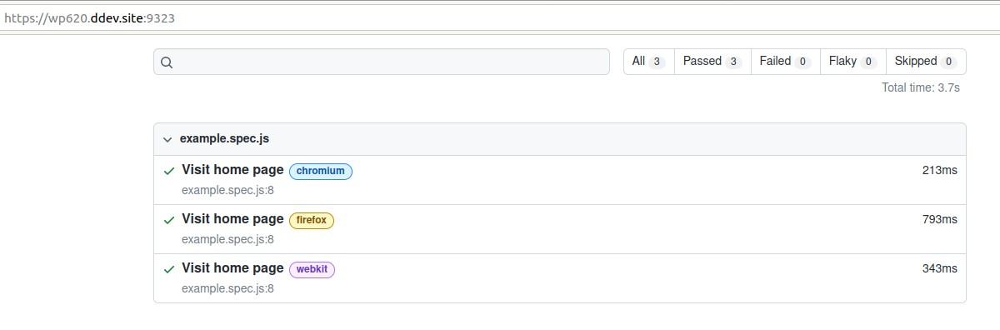
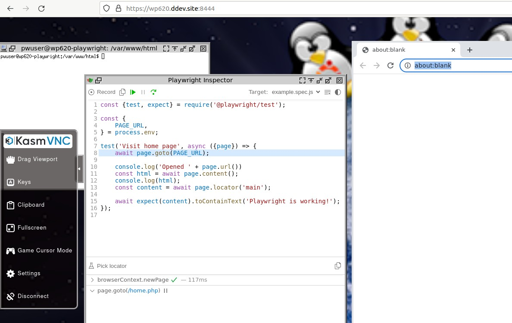

[](https://github.com/julienloizelet/ddev-playwright/actions/workflows/tests.yml) 

# ddev-playwright

<!-- START doctoc generated TOC please keep comment here to allow auto update -->
<!-- DON'T EDIT THIS SECTION, INSTEAD RE-RUN doctoc TO UPDATE -->
**Table of Contents**

- [Introduction](#introduction)
- [Installation](#installation)
- [Basic usage](#basic-usage)
  - [Quick start](#quick-start)
  - [Customization](#customization)
    - [Playwright testing directory](#playwright-testing-directory)
    - [`.env` file](#env-file)
  - [Add-on commands](#add-on-commands)
    - [Install Playwright from a `package.json` file](#install-playwright-from-a-packagejson-file)
    - [Init a Playwright project from scratch](#init-a-playwright-project-from-scratch)
    - [Run a Playwright command](#run-a-playwright-command)
  - [VNC server](#vnc-server)
  - [Other commands](#other-commands)
- [Technical notes](#technical-notes)
  - [`arm64`](#arm64)
  - [`.npmrc` file and `.ddev/homeadditions`](#npmrc-file-and-ddevhomeadditions)
- [Thanks](#thanks)
- [Contribute](#contribute)

<!-- END doctoc generated TOC please keep comment here to allow auto update -->

## Introduction

[Playwright](https://playwright.dev) was created to accommodate the needs of end-to-end testing. 

This DDEV add-on allows you to use Playwright in a separate `playwright` service.


## Installation

```bash
ddev get julienloizelet/ddev-playwright
ddev restart
```

## Basic usage

### Quick start

- Create a `tests/Playwright` folder in your project root directory (Only required for this "quick start").
- `ddev playwright-init --pm npm`
- `ddev playwright test`

### Customization

#### Playwright testing directory

Each command of this add-on runs inside the `PLAYWRIGHT_TEST_DIR` directory of the Playwright container.

By default, `tests/Playwright` is used as `PLAYWRIGHT_TEST_DIR` value, but you can override this value to suit your
need by creating a `docker-compose.override.yaml` (or any `docker-compose.<some-good-name>.yaml` file) in
the `.ddev`  root directory with the following content:

```yaml
services:
  playwright:
    environment:
      - PLAYWRIGHT_TEST_DIR=your/playwright/directory/path
```

If you want to use the root directory of your project, you can use the following value:

```yaml
services:
  playwright:
    environment:
      - PLAYWRIGHT_TEST_DIR=./
```


You could also edit the value directly in the `docker-compose.playwright.yaml` file, but you risk losing your changes every time you do a  `ddev get julienloizelet/ddev-playwright` (unless you delete the `#ddev-generated` line at the beginning of the file).

#### `.env` file

If there is a `.env.example` file in the `PLAYWRIGHT_TEST_DIR` folder, it will be copied (while running `ddev playwright-install` or `ddev playwright-init` )into a `.env` file (to be used with the `dotenv` package for example).

### Add-on commands


#### Install Playwright from a `package.json` file

- `ddev playwright-install --pm [npm|yarn]`

This command will install `playwright` and all dependencies in a folder defined by the environment variable `PLAYWRIGHT_TEST_DIR` of the `docker-compose.playwright.yaml` file.

You can choose to use `npm` or `yarn` as package manager by using the `--pm` option. By default, `yarn` is used.


**Before running this command**, ensure that you have a `package.json` file in the `PLAYWRIGHT_TEST_DIR` folder. 

You will find an example of such a file in the `tests/project_root/tests/Playwright`folder of this repository. 

<details>

<summary>Example of package.json file</summary>

```json
{
  "license": "MIT",
  "dependencies": {
      "@playwright/test": "^1.34.2",
      "dotenv": "^16.0.3"
  }
}
```

</details>


You will also find an example of a `playwright.config.js` file.

<details>
<summary>Example of playwright.config.js file</summary>

```javascript
// @ts-check
const { defineConfig, devices } = require('@playwright/test');

require('dotenv').config({ path: '.env' });

/**
 * @see https://playwright.dev/docs/test-configuration
 */
module.exports = defineConfig({
    testDir: './tests',
    /* Run tests in files in parallel */
    fullyParallel: true,
    /* Fail the build on CI if you accidentally left test.only in the source code. */
    forbidOnly: !!process.env.CI,
    /* Retry on CI only */
    retries: process.env.CI ? 2 : 0,
    /* Opt out of parallel tests on CI. */
    workers: process.env.CI ? 1 : undefined,
    /* Reporter to use. See https://playwright.dev/docs/test-reporters */
    reporter: [
        [process.env.CI ? 'github' : 'list'],
        ['html', {open: 'never'}],
    ],
    /* Shared settings for all the projects below. See https://playwright.dev/docs/api/class-testoptions. */
    use: {
        /* Base URL to use in actions like `await page.goto('/')`. */
        baseURL: process.env.BASEURL,
        ignoreHTTPSErrors: true,
        /* Collect trace when retrying the failed test. See https://playwright.dev/docs/trace-viewer */
        trace: 'on-first-retry',
    },

    /* Configure projects for major browsers */
    projects: [
        {
            name: 'chromium',
            use: { ...devices['Desktop Chrome'] },
        },

        {
            name: 'firefox',
            use: { ...devices['Desktop Firefox'] },
        },

        {
            name: 'webkit',
            use: { ...devices['Desktop Safari'] },
        },

    ],

});


```
</details>


#### Init a Playwright project from scratch

- `ddev playwright-init --pm [npm|yarn]`

This command will initialize a Playwright project in the `PLAYWRIGHT_TEST_DIR` as described in the [Playwright documentation](https://playwright.dev/docs/intro#installing-playwright).

You can choose to use `npm` or `yarn` as package manager by using the `--pm` option. By default, `yarn` is used.

**NB:** Please note that this command is interactive and [should not be used in CI context](https://github.com/microsoft/playwright/issues/11843).

#### Run a Playwright command

- `ddev playwright`

You can run all the playwright command with `ddev playwright [command]`.

- To run playwright's test command: 

  ```bash
  ddev playwright test
  ```

- To run with the Playwright UI tool.

  ```bash
  ddev playwright test --ui
  ```

- To run in headed mode.

  ```bash
  ddev playwright test --headed
  ```

- To generate playwright report

  ```bash
  ddev playwright show-report --host 0.0.0.0
  ```

  and then browse to `https://<PROJECT>.ddev.site:9323`

  

### VNC server

When running in UI/headed mode, you can use the provided Kasmvnc service by browsing to `https://<PROJECT>.ddev.site:8444`



It could be also used to generate playwright code by browsing with the following command: 

```bash
ddev playwright codegen
```

### Other commands

As for any DDEV additional service, you can use the `ddev exec -s playwright [command]` snippet to run a command in the playwright container.

For example: 

- `ddev exec -s playwright yarn install --cwd ./var/www/html/yarn --force`
- `ddev exec -s playwright yarn --cwd /var/www/html/yarn test "__tests__/1-simple-test.js"`

## Technical notes

### `arm64`

On `arm64` machine, edit the `playwright-build/Dockerfile` file to use `mcr.microsoft.com/playwright:focal-arm64` base image.

### `.npmrc` file and `.ddev/homeadditions`

If you wish to use a specific `.npmrc` file (for private NPM registries for example), you just need to place the `.npmrc` file in the `.ddev/homeadditions` folder of your project. This way, the `ddev playwright-install` command 
will automatically retrieve it.

More generally, all the `.ddev/homeadditions` folder content is copied to `/home/pwuser` folder when the `playwright` 
container is build.


## Thanks

[devianintegral/ddev-playwright](https://github.com/deviantintegral/ddev-playwright) is another way of implementing Playwright as a DDEV add-on. The main difference is that this other add-on embeds Playwright in the Web container. Everyone can choose what suits them best.

We'd like to thank [devianintegral](https://github.com/deviantintegral) for the fruitful discussions we've had and the fact that we  are using a few pieces of code taken directly from his repository.

## Contribute

Anyone is welcome to submit a PR to this repo.

**Contributed and maintained by [julienloizelet](https://github.com/julienloizelet)**
